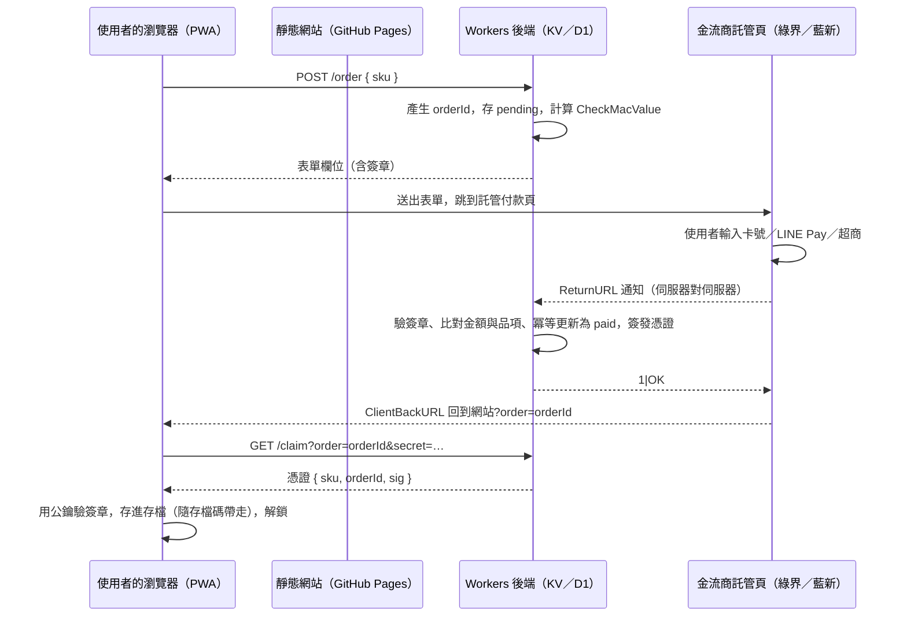

# 海月水母館：付費、金流與 App 路線規劃報告

五人專家小組（金流資安、行動架構、營利設計、臨床倫理、法規稅務）討論後的整合版。
日期：2026 年 9 月 26 日。純規劃，沒有改任何程式。

閱讀方式：第 1 節是手機上先看的摘要；第 2 到 8 節每節開頭先給三行結論，細節在後面。
凡是費率、門檻、法規數字，都以官方公告為準；報告裡標「待查證」的地方，第 8 節寫了要去哪裡查。

---

## 1. 一頁摘要

### 八條最重要的結論

1. **先做網頁付款，先不上商店。** App 一進 App Store 或 Google Play，數位商品就必須走 Apple IAP 或 Play 結帳。純網頁（PWA、加到主畫面）沒有這條限制。
2. **金流用台灣第三方支付的「託管付款頁」**：綠界或藍新，個人就能申請，沒有月費，信用卡約 2.75 至 2.8%，一頁同時收信用卡、Apple Pay、LINE Pay、超商、ATM。Stripe 不開放台灣個人；PayPal 不能做台灣境內交易。
3. **卡號永遠不經過你的伺服器。** 只需要一個很小的 serverless 後端（Cloudflare Workers 免費額度夠）做三件事：建訂單、驗回傳簽章、簽發購買憑證。
4. **沒有帳號也能讓購買跟著人走**：伺服器簽一張「憑證」存進存檔，隨存檔碼匯出匯入；另做「兌換碼」給送禮用。網頁沒問題；iOS App 內不能用兌換碼解鎖（指南 3.1.1），只能 IAP 加「復原購買」。
5. **賣「在館裡留下一點東西」，不賣「好得比較快」。** 第一批只賣三樣：館員證（一次性支持）、季節特展（主題加聲音）、投幣箱（隨喜）。光、心情紀錄、危機功能、水族箱容量永遠不賣。
6. **訂閱先不做。** 對脆弱的人是每月的壓力，又要帳號、定期扣款、退訂客服，商店規則也最嚴。唯一合理的訂閱是未來的「端對端加密備份」。
7. **付費提示不出現在心情儀式、危機畫面、剛陪完心情的一分鐘內。** 免費版永遠完整可用，寫進服務條款。
8. **法規門檻不高，記三件事**：每月銷售額超過起徵點（勞務約 5 萬，待查證）要辦稅籍登記；未達門檻仍併入綜所稅；結帳前告知「數位內容不適用七日鑑賞期」，但照樣給友善退款。轉蛋類機率商品不做。

### 建議路線圖（三階段）

| 階段 | 做什麼 | 工時 | 費用 |
|---|---|---|---|
| 一、網頁付款 | 綠界或藍新個人帳號、Workers 後端、憑證與兌換碼、館員證與特展、退款與隱私文件 | 3 至 5 週（業餘） | 固定成本 0，手續費約 3% |
| 二、Android | 補 PWA 的 manifest 與 service worker，Bubblewrap 包成 TWA 上 Play；App 內只「使用」不「購買」 | 1 至 2 週 | Google 一次性 25 美元 |
| 三、iOS（可選） | Capacitor 包殼、IAP 走 RevenueCat、商品目錄和網頁一致、藏起兌換碼 | 4 至 8 週，每年維護 | Apple 每年 99 美元、要有 Mac |

---

## 2. App 路線比較與建議

**三行結論**
- 第一階段只做 PWA（可加到主畫面、離線可用），不上任何商店，付款規則最單純，維護成本最低。
- Android 用 TWA（Bubblewrap）把同一個網站包上 Play，幾乎不用另外維護；iOS 只有 Capacitor 或原生兩條路，都會帶來每年的維護與審查成本，建議最後做、或不做。
- 一旦進商店，數位商品必須走商店結帳；所以商品目錄從第一天就要設計成「每一樣都能對應成一個 IAP 品項」。

### 2.1 四條路線的比較

| 路線 | 怎麼做 | 維護成本 | 上架費用 | 審查風險 | 推播 | 離線 | 付款規則 |
|---|---|---|---|---|---|---|---|
| PWA（加到主畫面） | 加 `manifest.json`、service worker；iOS 用 Safari「加入主畫面」 | 最低，和網站同一份程式 | 0 | 無審查 | Android 可以；iOS 16.4 以後只有「加到主畫面」的網頁才能收 Web Push | 可以（本站沒有圖片音檔，快取很小） | 自己選，沒有抽成 |
| Android TWA（Bubblewrap／PWABuilder） | 把 PWA 包成一個薄殼 APK，內容仍是線上的網站 | 低：網站更新即 App 更新；殼一年重簽一次左右 | Google 開發者一次性 25 美元 | 低；需要 Data safety 表單與 IARC 分級問卷 | 同 PWA | 同 PWA | 在 Play 上架後，App 內販售數位商品必須用 Play Billing（TWA 透過 Digital Goods API 與 Payment Request API 接）；「只使用、不販售」的 App 不必接 |
| Capacitor 包殼（iOS 與 Android） | 網站放進原生 WebView 殼，加少量原生外掛 | 中：兩個原生專案、Xcode 與 Android Studio 版本每年追、SDK 最低版本要求會變 | Apple 每年 99 美元、Google 25 美元；需要一台 Mac | 中：Apple 4.2「不能只是包起來的網站」，要加原生的東西（觸覺回饋、分享、通知、Widget 等）；心理健康相關內容會被多看一眼 | 原生推播 | 可以 | Apple：所有數位解鎖必須 IAP；Google 同上 |
| 原生（Swift／Kotlin） | 重寫 | 最高 | 同上 | 同上 | 原生 | 可以 | 同上 |

### 2.2 商店計費規定，白話版

1. **Apple 3.1.1**：App 內要解鎖功能、內容、遊戲內貨幣、完整版，一律用 IAP。**不能用自己的機制解鎖，明文包含序號（license keys）、QR code**。小費也要走 IAP。IAP 買的遊戲幣不得過期，而且要有「復原購買」。
2. **Apple 3.1.3(b) 多平台服務**：使用者在你的網站或其他平台買的內容、訂閱、功能（含多平台遊戲的消耗品），可以在 iOS App 裡使用，**前提是同一樣東西在 App 內也能用 IAP 買到**。
3. **Apple 3.1.3(e)**：實體商品或在 App 外消費的服務，反而不能用 IAP，要用 Apple Pay 或一般信用卡。所以「印成小冊子」這種實體品可以走自己的金流。
4. **Apple 3.1.3(f)**：付費網頁工具的免費配套 App 可以不用 IAP，條件是 App 內完全沒有購買、也沒有任何「去買」的呼籲。這條是寫給 VoIP、雲端硬碟一類的，遊戲能不能適用沒有保證，不要押在這上面。
5. **Google Play 付款政策**：在 Play 上發行的 App 要收數位商品的錢，必須用 Play 結帳系統；TWA 也算。但 Google 明確允許「只消費（consumption-only）」的 App：使用者在別處買，App 裡只使用，甚至可以用文字說明「可以到我們的網站購買」，只是不能放直接連結。（來源見第 8 節；直接連結的細節在 2025 年後有變動，待查證。）
6. **外部付款連結**：美國商店（Epic 案）、歐盟（DMA）、日本、韓國有各自的外部連結制度，**台灣商店目前查不到有這種豁免**，所以台灣使用者在 iOS App 內看到的購買只能是 IAP。
7. **抽成**：Apple 小型企業計畫，年收入未達 100 萬美元可申請 15%（新開發者一開始就適用，要每年確認）；Google Play 的低收入級距同樣是 15%（待查證）。

### 2.3 由此推導的建議

1. **第一階段只有網頁**：沒有商店規則，付款方式自由，錢也不被抽 15 到 30%。
2. **第二階段 Android TWA**：兩種做法二選一。
   - 做法 A「只使用不販售」：TWA 裡偵測到自己在 App 殼中（Bubblewrap 可以在啟動網址加參數，或用 `document.referrer` 是 `android-app://` 判斷），就把「支持這座館」的購買按鈕藏起來，只留「已經支持的人請用存檔碼或兌換碼」。不用接 Play Billing。
   - 做法 B 接 Play Billing：用 Digital Goods API，商品在 Play Console 建立，抽成 15%。多一套要維護的東西，但使用者體驗完整。
   - 建議先 A，等網頁付款穩定、真的有人從 Play 來，再考慮 B。
3. **第三階段 iOS**：只有兩種合規方式，「App 內完全沒有購買也沒有呼籲」或「所有商品都做成 IAP」。前者風險是 4.2 與 3.1.3(b) 的解讀；後者要用 StoreKit，建議透過 RevenueCat（有 Capacitor 外掛，同時管 Apple、Google、網頁的購買狀態）。**iOS 版必須藏起兌換碼輸入框**，因為 3.1.1 明文禁止序號解鎖。
4. **iOS 可以不做**：iOS 的 Safari 已支援加到主畫面、Web Push、Persistent Storage。做一頁「怎麼加到主畫面」的說明，很多人就夠用了。這對個人開發者是最省的選擇。

### 2.4 沒有帳號，購買怎麼跟著人走

現況：所有存檔在 `localStorage`（`js/store.js` 的 `moonjelly.save.v1`），設定裡可以匯出、匯入存檔碼。

建議的機制（網頁版）：

1. **簽章憑證（receipt）**：付款完成後，伺服器用私鑰（Ed25519）簽一段 JSON：`{ sku, orderId, issuedAt, nonce }`，回傳給網頁。網頁把它存進存檔（例如 `state.receipts[]`），前端用內建的公鑰（WebCrypto `crypto.subtle.verify`）驗證後才解鎖。因為存在存檔裡，**存檔碼匯出匯入時自然一起帶走**，換手機也在。
2. **兌換碼（redeem code）**：送禮或補救用。伺服器生成一次性代碼，兌換時打 API 換成上面的憑證，伺服器記錄「已兌換」。也可以用來處理「我付了錢但 localStorage 被清掉」的客服情況：用訂單編號重新領取。
3. **接受的風險**：存檔碼可以被複製給別人，憑證也就跟著複製。商品都是低價、個人化的紀念品，抓漏洞的成本高於損失，所以接受「君子制」。可以在憑證裡放一個購買者自己取的「館名」，顯示在牌子上，降低轉送的意願。
4. **在 App 裡的限制**：
   - Android TWA「只使用不販售」做法下，憑證與兌換碼都可以照用（Google 允許在別處購買、在 App 內使用）。
   - iOS App 裡：憑證（透過存檔碼匯入）屬於「在其他平台取得的內容」，只有當該商品也有 IAP 時才合規；兌換碼輸入框不能出現。IAP 買的要靠 Apple 的「復原購買」，不靠存檔碼。
5. **未來如果做帳號**：帳號只用來放加密備份，購買憑證仍舊是簽章 JSON，帳號不是必要條件。

### 2.5 PWA 要補的東西（第一階段就做）

1. `manifest.json`（名稱、圖示、`display: standalone`、`theme_color` 已有）。
2. service worker：預先快取 HTML、CSS、JS、字型；本站沒有圖片與音檔，快取幾百 KB 而已。
3. 存檔安全：Safari 對久沒用的網站有清除儲存的機制（加到主畫面的較寬鬆，Safari 17 之後可用 Persistent Storage API 申請不被清）。回來的畫面加一行「久沒來的話，記得先匯出存檔碼」。
4. 付款頁往返：手機上從 PWA 跳到託管付款頁會離開 App 殼，付完要能回來。做法是訂單建立時把 `orderId` 放在回跳網址，網頁載入時看到就去領憑證。

---

## 3. 台灣付款方式與金流商比較與建議

**三行結論**
- 選一家台灣第三方支付的「個人賣家」帳號（綠界或藍新），用託管付款頁，一次就能收信用卡、Apple Pay、LINE Pay、超商代碼、ATM。
- 代理商模式（Lemon Squeezy、Paddle、Gumroad、Polar）對台灣個人的優點是幫你處理各國稅務，缺點是付款方式只有卡與 Apple／Google Pay、以美元計價、撥款多一層費用；適合海外客群，不適合「台灣人最方便」這個目標。
- 安全的核心只有一句：卡號不經過你、回傳一定驗簽章、憑證由伺服器簽發、同一筆通知處理兩次也不會多發一次。

### 3.1 台灣使用者的付款方式，依方便程度

| 方式 | 適合誰 | 每筆成本（大約，待查證） | 注意 |
|---|---|---|---|
| 信用卡／金融卡（含 Apple Pay、Google Pay） | 大多數成年人 | 2.75 至 2.8%，綠界另加每筆 1 元處理費（Apple Pay 也加 1 元） | 主力。Apple Pay、Google Pay 只是卡的另一種輸入方式，都在同一個託管頁 |
| LINE Pay | 年輕人、沒信用卡的人 | 綠界或藍新代收約 3%；LINE Pay 直接申請約 3%（未稅） | 個人可以申請 LINE Pay 商家，但要 7 到 10 個工作天審核；透過金流商更省事 |
| 超商代碼 | 學生、沒有卡的人 | 每筆固定約 25 到 31 元 | 100 元以下的商品用超商代碼幾乎沒有利潤，超商只給 150 元以上的商品 |
| ATM 虛擬帳號 | 不想用卡 | 每筆固定約 10 到 15 元 | 付款不是即時的，憑證要等入帳通知 |
| 街口支付 | 有街口的人 | 約 2.5% | 街口商家需要營業登記，第一階段先不接 |
| TWQR | 各家錢包 | 依金流商 | 藍新可以透過 ezPay 開通，綠界也有；待查證 |
| PayPal | 海外使用者 | 約 4% 加提領 2.5% | **台灣境內交易自 2017 年起不能做**，台灣人付給台灣人會被擋；只對海外客有用 |

### 3.2 金流商比較

| 金流商 | 台灣個人可以申請 | 費率（大約） | 撥款 | 支援的方式 | 文件與沙盒 | 評語 |
|---|---|---|---|---|---|---|
| 綠界 ECPay 個人賣家 | 可以，身分證加本人帳戶 | 信用卡 2.75% 未稅，每筆加 1 元；無月費；30 日收款額度個人 20 萬（2026 年 1 月起有調整，待查證） | 付款後約 10 日內 | 信用卡、Apple Pay、LINE Pay、超商代碼、超商條碼、ATM、TWQR | 「全方位金流」託管頁；有測試環境與測試商店；CheckMacValue 簽章；中文開發者文件與社群範例最多 | **建議首選**，理由是文件與範例最豐富，個人能用的付款方式最齊 |
| 藍新 NewebPay 個人會員 | 可以，身分證加健保卡 | 信用卡 2.8%；提領每筆 10 元，每月前 5 次免；信用卡 30 日額度個人 20 萬 | 請款日加 10 日 | 信用卡、Apple Pay、Google Pay、LINE Pay、超商、ATM、TWQR（ezPay） | 幕前支付託管頁；AES 加密加 SHA 檢查碼；有測試環境 | 同樣好，Google Pay 支援比綠界明確；二選一即可 |
| TapPay（喬睿） | 個人透過「收款吧」App；開發者串接偏向公司 | 國內卡 2.4%、國外卡 3.5%、月費 400 元（待查證） | 待查證 | 卡、Apple Pay、Google Pay、LINE Pay | 前端 SDK 拿 token，後端請款；文件偏工程 | 費率低但有月費，量小時不划算；個人能否走開發者串接待查證 |
| LINE Pay 直接串接 | 個人可申請商家 | 約 3% 未稅 | 待查證 | 只有 LINE Pay | 線上 API | 只多一種方式，不值得單獨串；透過綠界或藍新即可 |
| Stripe | **不開放台灣**（要有美國、英國、新加坡等地的公司） | 無 | 無 | 無 | 無 | 排除。用境外公司帳號在稅務與合規上都是坑 |
| PayPal | 個人可以，但境內交易被禁 | 約 4% 加提領 2.5% | 玉山提領 | 卡、PayPal 餘額 | 有 | 只作為海外使用者的備用 |
| Lemon Squeezy（已被 Stripe 收購） | 待查證是否接受台灣個人；撥款走 PayPal（美元）或銀行（台灣是否在名單待查證） | 5% 加每筆固定費，國際卡加 1.5%，非美國銀行撥款加 1% | 兩週一次 | 卡、Apple／Google Pay、PayPal | 託管結帳、發票、退款都代管 | 代理商模式的好處是它是賣家（merchant of record），各國稅務由它扛；壞處是台灣人常用的 LINE Pay、超商都沒有，且美元計價 |
| Paddle | 主要對公司；個人審核不確定，待查證 | 5% 加 50 美分 | 待查證 | 卡、PayPal、Apple／Google Pay | 好 | 適合 B2B SaaS，不適合這個規模 |
| Gumroad | 可以，台灣可以直接匯台幣（門檻 800 元，待查證） | 10% 加手續費 | 待查證 | 卡、PayPal | 頁面式，API 有限 | 上手最快，但 10% 偏貴、無法客製結帳頁 |
| Polar | 用 Stripe Connect Express 撥款，台灣列在支援名單（待查證） | 約 5% 加 50 美分 | 待查證 | 卡、Apple／Google Pay | 開發者導向、開源 | 代理商模式裡最像「給獨立開發者的」，如果將來想賣海外可以考慮 |

**結論**：第一階段選綠界或藍新其中一家（兩家都申請也行，先用一家）。**如果有一天想賣給海外華語使用者，再加一個代理商（Polar 或 Lemon Squeezy）作為「海外通道」**，兩條通道都只發同一種憑證。

### 3.3 安全架構

原則：

1. **託管付款頁**：使用者在綠界或藍新的頁面輸入卡號，你的網站與伺服器從頭到尾看不到卡號，PCI DSS 的責任落在金流商。
2. **不信任客戶端**：瀏覽器回傳的「付款成功」（OrderResultURL、ClientBackURL）只拿來導頁，不拿來發貨。**只有伺服器收到的 ReturnURL 通知、驗過簽章、金額與品項比對相符，才簽憑證。**
3. **驗簽章**：綠界是 CheckMacValue（HashKey、HashIV 做 SHA-256），藍新是 AES 解密加 SHA-256 檢查碼。兩者都要在伺服器做，密鑰放環境變數或 Workers secret。
4. **冪等**：同一筆通知可能重送。用訂單編號當唯一鍵，狀態只能從 `pending` 走到 `paid` 一次；第二次來就直接回應成功（綠界要回 `1|OK`），不重發憑證。
5. **憑證由伺服器簽發**：Ed25519 私鑰只在伺服器；公鑰寫死在前端。憑證裡有 `sku`、`orderId`、`issuedAt`、`nonce`，前端驗簽章，過了才解鎖。
6. **HTTPS**：GitHub Pages 或 Cloudflare Pages 都預設 HTTPS；Workers 也是。金流商的 ReturnURL 必須是公開的 HTTPS 網址。
7. **日誌不留個資**：伺服器只存訂單編號、品項、金額、時間、狀態、金流商交易編號。不存姓名、電話、卡號末四碼；金流商頁面收的 email 留在金流商那邊。真的需要聯絡時用金流商後台查。
8. **沙盒**：綠界有測試環境與測試商店（`payment-stage`），藍新有測試站；先在測試環境跑完整流程、重送通知、竄改金額、重複兌換，再切正式。
9. **最小攻擊面**：後端只有四個端點，全部無狀態，資料放 KV 或 D1；不放任何心情內容。
10. **速率限制與防刷**：`/order` 與 `/redeem` 做 IP 速率限制；兌換碼用高熵（例如 16 個字元、去掉容易混淆的字母），失敗次數多就延遲回應。

架構圖（mermaid）：

後端端點：

| 端點 | 做什麼 | 存什麼 |
|---|---|---|
| `POST /order` | 建訂單、回傳送到金流商的表單欄位 | `orders[orderId] = { sku, amount, status: pending, claimSecret, createdAt }` |
| `POST /notify`（ReturnURL） | 驗簽章、比對、冪等更新、簽憑證 | `status: paid, tradeNo, paidAt, receipt` |
| `GET /claim` | 用 orderId 加 claimSecret 領憑證（付款前先給的 secret，防止別人猜訂單號領走） | 無 |
| `POST /redeem` | 兌換碼換憑證，一次性 | `codes[code] = { sku, usedAt }` |
| `GET /pubkey` | 公鑰（也可以寫死在前端） | 無 |

未來若接 Apple、Google IAP，RevenueCat 的 webhook 打到同一個 Workers，簽出同樣格式的憑證，前端不用知道錢是從哪裡來的。

### 3.4 成本試算（給定價用）

假設一件商品 120 元：

- 信用卡：120 × 2.75% 加 1 元約 4.3 元，實收約 115.7 元；加 5% 營業稅（綠界手續費的稅）差異不大。
- 超商代碼：固定約 30 元，實收 90 元。所以超商只開放給 150 元以上的品項。
- 代理商（5% 加 0.5 美元加 1% 撥款）：約 26 元，實收約 94 元，而且是美元。

---

## 4. 賣什麼、怎麼賣

**三行結論**
- 只賣「你在館裡留下的東西」與「館的特展」：一次性、看得見、不影響光、不影響生物。
- 第一批三樣就夠：館員證（一次性支持者方案）、季節特展（主題加聲音）、投幣箱（隨喜）。之後再加送禮、實體年鑑、加密備份。
- 絕對不賣：光、記心情的權利、危機功能、關提醒、水族箱容量、任何隨機（轉蛋）商品、任何「付錢會比較快好起來」的暗示。

### 4.1 十八個選項

評分：收入潛力（高、中、低）、實作成本（天）、維護成本（低、中、高）。價格只是量級，實際定價見 4.4。

| # | 選項 | 對誰有價值 | 和原則有沒有衝突 | 收入 | 實作 | 維護 | 建議 |
|---|---|---|---|---|---|---|---|
| 1 | **館員證**（一次性支持者方案，約 150 至 300 元）：牌子上一行小字「這座館由你支持」、可以取一個館名、拍照時可選加上館名浮水印、一個只給館員的安靜裝飾（例如角落的一盞小燈籠，不發光不給光） | 喜歡這裡、想說謝謝的人 | 無。不給光、不影響生物 | 中 | 3 至 5 天 | 低 | **第一批** |
| 2 | **投幣箱**（隨喜付費、小費罐；館裡的許願池，投一枚硬幣，海底多一枚硬幣，最多顯示幾枚） | 不想買東西但想支持的人 | 無，只要不給光 | 低到中 | 2 天 | 低 | **第一批**。iOS App 內小費必須走 IAP |
| 3 | **季節特展**（主題加聲音包的解鎖：例如「秋、雨季、深冬、夏夜」，每檔含一個 THEMES 主題、一組音階或樂器、一兩個裝飾） | 喜歡換風景、收藏的人 | 現在的 6 個主題用光買，要維持。特展是**額外**的、只用錢買，不能用光買，也不能反過來拿錢買原本用光的主題 | 中到高（可以每季出） | 每檔 4 至 8 天（畫面與音效都是程式生成，成本主要是設計） | 中（每季一檔） | **第一批**一檔 |
| 4 | **聲音包**單獨賣（不同音階、樂器音色，例如鋼片琴、玻璃琴、雨聲底噪） | 戴耳機的人 | 無 | 低到中 | 3 至 5 天 | 低 | 併入特展 |
| 5 | **裝飾包**（標本圖版風格的一組裝飾） | 布置派 | 現有裝飾用光買，付費裝飾要明顯是「另一類」（例如展廳的家具：長椅、說明牌框），不能是更強的棲地 | 低到中 | 4 天 | 低 | 第二批 |
| 6 | **送禮**（買一張館員證或特展送人，產生兌換碼） | 想關心朋友的人 | 措辭要小心：是「送一座安靜的地方」，不是「你看起來需要」 | 中 | 2 天（在兌換碼上加一層） | 低 | 第二批，網頁限定；iOS 內不能出現兌換碼 |
| 7 | **留一張票在門口**（pay it forward：多買一張，放進公共的票口；任何人按「我現在付不起」就可以領） | 付得起的人與付不起的人 | 完全符合心理安全 | 低（是善意，不是收入） | 2 天 | 低 | 第二批，很有品牌意義 |
| 8 | **潮汐年鑑**（把一年的紀錄排版成可列印的 PDF：名字、陪法、浪退最多的一次、寫給自己的話；本地生成，不上傳） | 記了很久的人 | 匯出自己的資料應該免費；賣的是「排版與裝幀」，免費版永遠有純文字匯出 | 中 | 6 至 10 天 | 低 | 第三批 |
| 9 | **實體商品**（明信片、貼紙、海報，用蝦皮或 Pinkoi 代賣；或年鑑印成小冊子） | 想要摸得到的東西 | **不受 IAP 規定限制**（Apple 3.1.3(e)）。印個人紀錄涉及隱私，建議讓使用者自己拿 PDF 去印，你只賣不含個資的周邊 | 低到中 | 設計為主 | 中（物流、退換） | 可選，用現成平台，不自建 |
| 10 | **跨裝置加密備份**（需要帳號；端對端加密，伺服器只看到密文；每年一筆儲存費） | 換手機、怕遺失的人 | 存檔碼永遠免費；付的是儲存與同步的成本 | 中 | 15 至 25 天（帳號、加密、刪除） | 中到高 | 第四階段，唯一合理的訂閱 |
| 11 | **匯出紀錄**（CSV、純文字、JSON） | 所有人 | 這是使用者自己的資料，**不賣，免費** | 無 | 1 天 | 低 | 免費功能 |
| 12 | **更大的水族箱** | 養很多水母的人 | 現在用光升級（400、1200、3000）。拿錢買容量等於跳過光，**不賣** | 高（所以才危險） | 0 | 0 | 不賣 |
| 13 | **付費消耗品**（零食、召喚事件） | 想加速的人 | 零食影響水母的亮度，拿錢買等於買光，**不賣** | 中 | 0 | 0 | 不賣 |
| 14 | **訂閱**（每月會員） | 平台 | 對脆弱的人形成每月的提醒與壓力；要帳號與定期扣款（個人賣家的定期定額常需要特約資格，待查證）；商店規則最嚴；退訂客服最多。唯一例外是第 10 項 | 中 | 高 | 高 | 先不做 |
| 15 | **機構版**（學校輔導室、諮商所、公司 EAP：一批兌換碼、一份說明手冊、不蒐集任何資料的承諾） | 機構 | 無，反而符合定位；需要開發票，所以要等有營業登記 | 中到高 | 3 天（在兌換碼上加批次） | 低 | 第三批以後 |
| 16 | **原聲帶**（把 Web Audio 生成的音樂錄成幾首，放 Bandcamp 或 StreetVoice） | 喜歡音樂的人 | 無 | 低 | 2 至 3 天 | 低 | 可選，完全不碰 App 規則 |
| 17 | **創館會員**（早鳥版館員證：前 N 位，多一個「第一批館員」的字樣；永不再賣） | 早期支持者 | 「限量」對這個產品要謹慎，只能是紀念意義，不能是功能差異，也不倒數 | 低 | 0（館員證的變體） | 低 | 可以，但不做倒數與催促 |
| 18 | **桌布與 Live Wallpaper**（水族箱靜態或動態桌布） | 想帶著走的人 | 無 | 低 | 3 至 5 天 | 低 | 可選 |

### 4.2 你可能沒想到的

1. **不要把付費商品放進「貝殼商店」。** 貝殼商店是光的世界，錢一進去，光的稀有感就被稀釋。付費的東西放在「更多」裡的「支持這座館」或「館的門口」，畫面上像是館的入口處的一張說明牌，不像商店。
2. **每一樣付費品都要能「用光的邏輯解釋」它為什麼不能用光買。** 說法：光是水母發的，只能換海裡的東西；特展和館員證是館外的人（你）留下的，所以用人的錢。
3. **超商代碼的固定費用會吃掉小額商品。** 100 元以下只開信用卡與 LINE Pay；150 元以上才開超商。
4. **定價用台灣人熟悉的錨**：「一杯手搖飲」（60 至 80 元）、「一杯咖啡」（120 至 150 元）、「一場電影」（300 元）。館員證用咖啡的價位，特展用手搖飲的價位。
5. **憑證放在存檔裡，代表清除存檔就會清掉購買**。設定裡「重新開始」的確認框要多一句「你支持的紀錄會一起清掉，請先匯出存檔碼」，並且提供「用訂單編號重新領取」。
6. **一律友善退款**：法律上數位內容可以先告知而排除七日鑑賞期，但對這個產品，「7 天內不問理由退款」本身是品牌。退款後憑證要能撤銷：憑證裡的 `orderId` 進伺服器的撤銷名單，前端下次連線時查一次（離線時仍可用，這是可接受的寬鬆）。
7. **在 iOS App 內「同一樣東西也要有 IAP」**這條，意味著商品目錄不能太多太細。建議 SKU 永遠不超過十個：館員證 1 個、特展每檔 1 個、小費 3 個面額。
8. **送禮的措辭比功能重要**。禮物頁不寫「送給需要的人」，寫「送一座安靜的地方給誰」；收禮的人打開時不會知道是誰送的，除非送的人留了名字。
9. **「留一張票在門口」比折扣碼更適合這裡**：它讓「付不起」變成一個可以誠實按下去的按鈕，而不是被擋在外面。
10. **機構版**是這類產品最常被忽略的收入：學校輔導室與諮商所會買「一批可以給學生的安靜工具」，前提是你能出示隱私承諾與發票。
11. **不要做「每月上限」以外的任何配額商品**：像「今天前三份心情給光」這種規則永遠不能有付費版本。
12. **代理商模式的隱藏成本**：撥款是美元，換匯與提領各扣一層；台灣人看到美元定價會遲疑；LINE Pay 與超商都沒有。它只適合海外通道。

### 4.3 絕對不賣的清單

1. **光**：任何形式，包含「光的加成」「離線效率」「寶箱冷卻」。
2. **記錄心情的權利**：儀式的任何步驟、任何陪法、任何生物、潮汐圖、每週回顧。
3. **危機與專線功能**：以及「需要找人說話的時候」那個入口。
4. **關掉提醒**、關掉任何通知：提醒本來就可以免費關。
5. **讓水母不死**：本來就不會死。也不賣「水母的健康」「亮度」。
6. **水族箱容量、繁殖冷卻、水螅體上限**。
7. **轉蛋、盲盒、隨機的付費品項**：台灣有機率揭露的規範，Apple 也要求揭露機率，而且「碰運氣」和療癒的定位衝突。
8. **限時、倒數、錯過就沒有**：連特展下架都不倒數，只寫「這檔特展到某月某日」，下檔後保留已購者的使用權。
9. **任何「付了會比較快好起來」的暗示**：包括「進階練習」「更有效的陪法」「專業版」這類命名。
10. **使用者的資料**：不賣、不分享、不做廣告投放。
11. **連續天數、成就加速**：本來就不做連續天數。

### 4.4 建議的第一批商品與定價（量級）

| 商品 | 價格 | 類型 | 內容 |
|---|---|---|---|
| 館員證 | 150 至 240 元，一次性 | 非消耗解鎖 | 館名、拍照浮水印可選、角落小燈籠、感謝的一行字 |
| 特展「雨季」 | 60 至 90 元，一次性 | 非消耗解鎖 | 一個主題（雨打水面）、一組音色、一個裝飾 |
| 投幣箱 | 30、60、120 元 | 小費 | 海底多一枚硬幣（上限顯示 12 枚，之後只記數） |

---

## 5. 付費倫理準則

**三行結論**
- 付費是「你在館裡留下一點東西」，永遠不是「你會好得比較快」；這句話要出現在付費頁的第一行。
- 付費提示不出現在心情儀式、危機畫面、剛陪完心情的一分鐘內；也不用限時、倒數、社會比較、罪惡感。
- 若將來做同步，一定是端對端加密、資料最少、可一鍵刪除，伺服器永遠讀不到心情內容。

### 5.1 這種產品裡，哪些付費設計會造成傷害

1. **在人最脆弱的時候推銷**：儀式進行中、強度 8 以上、危機字詞觸發後、深夜 21 到 07 點（色彩專家已把總光量降下來的時段）。
2. **用「錯過就沒有」製造焦慮**：限時特展、倒數、限量。焦慮敏感的人會被這種設計直接傷到。
3. **把紀錄綁在付費牆後**：例如「超過 30 天的紀錄要付費才能看」。這等於拿人的記憶勒索。
4. **付費影響情緒回饋**：付費的水母比較亮、付費的人給的光比較多。這會讓人把「我值不值得」和「我付不付得起」綁在一起。
5. **用罪惡感**：「水母在等你」「你已經三天沒來了」這類文案，即使免費也不做，付費更不做。
6. **暗示療效**：「進階版能更快平靜」是醫療宣稱，既不誠實，也可能觸及醫療器材與廣告的規範。
7. **對未成年人**：小額、衝動、看不懂的付費頁。

### 5.2 準則（建議直接放進 DESIGN.md）

1. 免費版永遠完整可用，寫進服務條款：所有心情功能、生物、潮汐圖、回顧、危機功能不會有付費版本。
2. 付費的東西只有三類：紀念（館員證、館名）、風景（特展）、感謝（投幣箱）。每一樣都不影響光、生物、規則。
3. 付費入口只在一個地方：「更多」裡的「支持這座館」。不在儀式、不在結果卡、不在危機畫面、不在歡迎回來卡、不在通知。
4. 陪完心情之後的安靜時段（現有 `UI.quiet`）內，任何付費相關的畫面都不出現；危機紀錄之後整段安靜，付費入口也一起安靜。
5. 不用限時、倒數、限量、社會比較（「已有 1,234 人支持」也不用）、罪惡感、彈出式視窗。
6. 付費頁第一行固定是「這裡的一切都是免費的。如果你想在館裡留下一點東西，可以從這裡。」
7. 買了什麼，畫面上就多一樣安靜的東西；不多一個數字、不多一個進度條。
8. 退款：7 天內不問理由；退款後不責備，牌子上的字安靜地消失。
9. 送禮的文案不含「你需要」「你看起來」；收禮的人可以拒收。
10. 「留一張票在門口」永遠開著：任何人都可以按「我現在付不起」領取館員證，不驗證、不追問。
11. 定價與付款方式不區分人：沒有 A／B 測試定價、沒有依行為投放折扣。
12. 未來若做帳號與同步：端對端加密（金鑰從使用者的通關密語導出，伺服器只存密文，忘了密語就真的打不開，要說清楚）、只存密文與最少的中繼資料、一鍵刪除立即生效並在 30 天內清掉備份、不做任何分析。
13. 任何付費相關的設計改動，先過一次「在最糟的一天打開它會怎樣」的檢查。

---

## 6. 法規與稅務檢查清單（以官方公告為準，需再查證）

**三行結論**
- 個人賣數位內容不必先有公司；每月銷售額超過起徵點（勞務約 5 萬，2025 年起，待查證）才要辦稅籍登記，未達門檻仍要併入綜所稅申報。
- 結帳前告知「數位內容一經提供不適用七日鑑賞期」是合法的例外，但建議照樣給友善退款；轉蛋類機率商品與遊戲點數不做，就避開最麻煩的兩套規範。
- 隱私權政策與服務條款從第一階段就要有；沒有帳號時要蒐集的個資最少，但金流商那邊仍會有 email 與交易紀錄。

### 6.1 檢查清單

| # | 項目 | 目前理解（待查證） | 對這個專案的意思 | 去哪裡查 |
|---|---|---|---|---|
| 1 | 營業稅起徵點與稅籍登記 | 個人網路銷售：貨物每月 10 萬、勞務每月 5 萬（原 8 萬與 4 萬，查到的資料說 2025 年 1 月 1 日起調高；另一來源寫 2026 年，日期待查證）。超過就要向國稅局辦稅籍登記 | 數位內容屬於勞務，門檻是每月 5 萬。初期不會到；到了要立刻辦 | 財政部稅務入口網「網路交易課徵營業稅 Q&A」 |
| 2 | 未達門檻的所得 | 仍要把年度營業所得併入個人綜合所得稅申報 | 每筆撥款記帳，年底申報 | 同上 |
| 3 | 登記後的營業稅 | 每月未達 20 萬屬小規模營業人，免用統一發票，按查定銷售額課 1%；達 20 萬由稽徵機關核定使用統一發票，稅率 5% | 只有真的長大才會遇到 | 財政部、國稅局 |
| 4 | 電子發票 | 綠界、藍新可以代開，但要有統一編號（商務賣家） | 第一階段不開發票，是合法的（未達門檻不是營業人）。機構版需要發票，所以放在登記之後 | 綠界電子發票說明 |
| 5 | 消保法七日鑑賞期 | 通訊交易解除權合理例外情事適用準則第 2 條第 5 款：「非以有形媒介提供之數位內容或一經提供即為完成之線上服務，經消費者事先同意始提供」可不適用，前提是企業經營者**事前告知** | 結帳頁要有勾選「我了解數位內容一經提供，不適用七日解除權」。但建議自願給 7 天退款 | 全國法規資料庫 J0170012、行政院消保處 |
| 6 | 網路連線遊戲定型化契約應記載及不得記載事項 | 適用網路連線遊戲；包含遊戲點數退費、停止營運 30 日前公告、機率商品揭露（2023 年起）。單機式、無帳號的網頁遊戲是否適用，待查證 | **不賣點數（光）、不做機率商品**，就避開最麻煩的部分。仍建議：若停止營運，提前 30 天公告並提供存檔匯出 | 行政院全球資訊網「定型化契約應記載及不得記載事項」、數位發展部 |
| 7 | 遊戲軟體分級管理辦法 | 供應遊戲軟體者應標示分級；無包裝的（網頁、App）在說明、下載或起始網頁明顯處標示，一般級別不小於 45 像素見方。本作內容應屬普遍級 | 在開場畫面或「關於」頁放「普遍級」標示；上商店時 IARC 問卷會再做一次 | 數位發展部「數位娛樂軟體分級查詢網」 |
| 8 | 未成年人 | 民法成年年齡 18 歲（2023 年起）；7 到 18 歲為限制行為能力人，付費行為原則上需法定代理人允許 | 結帳頁一句「未滿 18 歲請和家長一起」；家長來要求退款一律退 | 民法第 12、77、79 條 |
| 9 | 個人資料保護法 | 2025 年 11 月公布修正條文，設個人資料保護委員會，資安事件通知義務（72 小時，施行日期待查證）。無論規模大小，蒐集個資都要告知目的、期間、對象、方式與當事人權利 | 現在沒有帳號，網站本身不蒐集個資；但金流商會有 email 與交易資料。隱私權政策要寫清楚「我們拿到什麼、金流商拿到什麼、怎麼刪」 | 個人資料保護委員會籌備處、全國法規資料庫 I0050021 |
| 10 | 隱私權政策與服務條款 | App 商店強制要求；Apple 還要 App Privacy Details（隱私標籤），Google 要 Data safety 表單 | 第一階段就寫，放在「更多」裡。內容：資料只在裝置、存檔碼是使用者自己保管、付費資料由金流商處理、退款政策、免費版永遠完整 | Apple、Google 開發者文件 |
| 11 | 心理健康相關的宣稱 | 食藥署「醫用軟體分類分級參考指引」：只做日常健康管理、不涉及疾病診斷與治療的軟體不是醫療器材 | 全站用字維持「陪伴」「練習」「記下來」，不寫「治療」「改善憂鬱」「療效」。付費頁更不能寫 | 食藥署醫療器材專區 |
| 12 | Apple 的健康類規定 | 1.4.1 醫療類 App 審查較嚴，應提醒諮詢專業人員；5.1.3 健康資料不得用於廣告與資料探勘；5.1.1(v) 不可強制登入、有帳號就要能在 App 內刪帳號 | 「關於」與危機畫面都已符合方向；上架時在審查備註寫明「所有資料只在裝置、不上傳」 | Apple App Review Guidelines |
| 13 | Google Play 健康類政策 | Play 有 Health apps 政策與 Data safety 要求（細節待查證） | 同上 | Play Console 說明中心 |
| 14 | 海外收入 | 若用代理商模式，撥款是美元，仍是台灣的營業所得；換匯與申報方式建議問會計師 | 第一階段不用 | 會計師 |
| 15 | 退款政策的位置 | 消保法要求資訊揭露；金流商申請時也會要求商店有退款規定 | 「支持這座館」頁面底部一段：7 天內不問理由、怎麼申請、多久退 | 綠界或藍新的商店審核要求 |

---

## 7. 分階段路線圖與工作量估計

**三行結論**
- 第一階段（網頁付款）3 到 5 週業餘時間可以完成，固定成本 0 元，後端不到 400 行。
- 第二階段（Android TWA）1 到 2 週，25 美元；第三階段（iOS）4 到 8 週加每年維護，是唯一「可以不做」的階段。
- 每個階段都先在測試環境跑完整的攻擊清單（重送、竄改、重複兌換）與「最糟的一天」倫理檢查，再上線。

### 第 0 階段：準備（1 週）

| 類別 | 工作 |
|---|---|
| 文件 | 把第 5 節的準則寫進 `DESIGN.md`；草擬隱私權政策、服務條款、退款政策；「普遍級」標示 |
| 決策 | 第一批商品與定價；選綠界或藍新；決定憑證格式（`sku`、`orderId`、`issuedAt`、`nonce`、`name`） |
| 申請 | 金流商個人帳號（身分證、本人帳戶；藍新另要健保卡）；Cloudflare 帳號 |

### 第 1 階段：網頁付款（3 到 5 週）

| 類別 | 工作 | 估計 |
|---|---|---|
| 後端（Cloudflare Workers 加 KV） | `/order`、`/notify`、`/claim`、`/redeem`；簽章驗證；Ed25519 簽發；冪等；速率限制；撤銷名單 | 4 至 6 天 |
| 前端 | `state.receipts[]` 進存檔與存檔碼；公鑰驗證；「支持這座館」頁（在「更多」裡，不在貝殼商店）；付款回跳領取；兌換碼輸入；重新開始的警語；離線時沿用已驗證的憑證 | 4 至 6 天 |
| 商品 | 館員證（館名、小燈籠、浮水印）、一檔特展（主題加音色加裝飾）、投幣箱（硬幣） | 5 至 8 天 |
| PWA | `manifest.json`、service worker、加到主畫面說明頁 | 1 至 2 天 |
| 測試 | 沙盒完整流程；重送通知；竄改金額與品項；重複兌換；存檔清除後用訂單重新領取；桌面與手機截圖；倫理檢查（儀式中、危機後、深夜） | 2 至 3 天 |
| 文件 | 隱私、條款、退款、七日鑑賞期告知、記帳表 | 1 天 |

### 第 2 階段：Android（1 到 2 週）

| 類別 | 工作 | 估計 |
|---|---|---|
| 包殼 | Bubblewrap 產生 TWA 專案、Digital Asset Links、簽章金鑰保管 | 1 至 2 天 |
| 前端 | 偵測 TWA 環境時隱藏購買按鈕（做法 A）；或接 Digital Goods API（做法 B，加 3 至 5 天） | 1 天 |
| 上架 | Play Console、Data safety、IARC 分級、截圖、隱私網址 | 1 至 2 天 |
| 測試 | 內部測試軌道、實機安裝、存檔碼在 App 與瀏覽器之間搬 | 1 天 |

### 第 3 階段：iOS（可選，4 到 8 週，之後每年 1 到 2 週維護）

| 類別 | 工作 | 估計 |
|---|---|---|
| 包殼 | Capacitor 專案、圖示與啟動畫面、原生的小東西（觸覺回饋、分享、通知）以過 4.2 | 5 至 8 天 |
| 付款 | RevenueCat 加 StoreKit；商品目錄鏡射網頁；webhook 進同一個 Workers 簽同樣的憑證；復原購買 | 5 至 8 天 |
| 合規 | iOS 版隱藏兌換碼與網頁付款；審查備註寫明資料只在裝置；隱私標籤 | 1 至 2 天 |
| 上架與審查 | 可能來回 1 到 3 次 | 1 至 2 週等待 |
| 維護 | 每年 Xcode、iOS SDK、Capacitor 大版本更新；99 美元年費 | 每年 1 至 2 週 |

### 第 4 階段：擴充（都是可選）

1. 送禮與「留一張票在門口」（各 2 天）。
2. 潮汐年鑑 PDF（6 至 10 天）。
3. 機構版兌換碼批次（3 天，需先有發票能力）。
4. 端對端加密備份與帳號（15 至 25 天；這時才需要資料庫、刪除流程、個資法的完整告知）。
5. 海外通道（Polar 或 Lemon Squeezy），同一種憑證（3 至 5 天）。

---

## 8. 待查證清單與來源

**三行結論**
- 綠界、藍新、財政部、法規資料庫的官網在這個沙盒被擋，費率與門檻是從搜尋摘要與第三方整理來的，正式決定前要到官網再看一次。
- 最需要親自確認的三件事：金流商個人賣家現在支援哪些付款方式與額度、營業稅起徵點的生效日期、Google Play「只使用不販售」的最新細則。
- 法規類的請以全國法規資料庫與主管機關公告為準；金額與費率類的以金流商當下的費率表為準。

### 8.1 待查證

| # | 待查證的事 | 去哪裡查 |
|---|---|---|
| 1 | 綠界個人賣家 2026 年 1 月起的 30 日收款額度、信用卡費率、每筆處理費、Apple Pay 與 TWQR 是否開放個人 | `ecpay.com.tw/Business/payment_fees`、公告 nID=5946、support.ecpay.com.tw/25132 |
| 2 | 藍新個人會員的費率、Google Pay 與 LINE Pay 是否開放個人、撥款天數 | `newebpay.com/website/Page/content/service_fare`、常見問題 |
| 3 | TapPay 個人是否能走開發者串接、月費與費率 | tappaysdk.com、TapPay 客服 |
| 4 | LINE Pay 線上商家個人申請條件與費率 | pay.line.me 商家申請頁 |
| 5 | Lemon Squeezy、Paddle 是否接受台灣個人賣家；台灣銀行撥款是否在名單 | docs.lemonsqueezy.com「supported countries」「fees」；paddle.com |
| 6 | Gumroad 台灣台幣撥款門檻與費率 | gumroad.com/help「getting paid」 |
| 7 | Polar 台灣是否在支援名單、費率 | polar.sh/docs「supported countries」「pricing」 |
| 8 | 營業稅起徵點（貨物 10 萬、勞務 5 萬）的生效日期是 2025 還是 2026 年 1 月 1 日 | 財政部稅務入口網「網路交易課徵營業稅 Q&A」 |
| 9 | 小規模營業人每月 20 萬與 1% 查定的現況 | 財政部、各區國稅局 |
| 10 | 網路連線遊戲定型化契約是否適用於無帳號的單機式網頁遊戲 | 行政院消保處、數位發展部；必要時發函詢問 |
| 11 | 遊戲軟體分級管理辦法對純網頁遊戲的標示要求 | 數位娛樂軟體分級查詢網 gamerating.org.tw |
| 12 | 個資法 2025 年修正條文的施行日期與 72 小時通知的細則 | 個人資料保護委員會籌備處 pdpc.gov.tw、全國法規資料庫 I0050021 |
| 13 | Google Play 付款政策中「只使用」App 的最新細則，以及外部連結在 2025 年美國判決後的變化 | Play Console 說明「Understanding Google Play's Payments policy」（answer 10281818）、「external payment links」（answer 16805335） |
| 14 | Google Play 的 15% 抽成級距 | Play Console 說明「Service fees」 |
| 15 | Apple 小型企業計畫的申請與續約細節 | developer.apple.com/app-store/small-business-program |
| 16 | 台灣是否有 App Store 外部付款連結的制度 | 公平交易委員會、Apple 開發者新聞 |
| 17 | Cloudflare Workers 與 KV 的免費額度 | developers.cloudflare.com/workers/platform/pricing |
| 18 | iOS 加到主畫面的儲存清除規則與 Persistent Storage 現況 | webkit.org 部落格、Apple 開發者文件 |
| 19 | 民法成年年齡與限制行為能力人的付費規定 | 全國法規資料庫 民法 |

### 8.2 本報告參考的來源（查到的）

金流：
- 綠界服務費率表 https://www.ecpay.com.tw/Business/payment_fees
- 綠界 2026 年個人賣家 30 日收款額度調整公告 https://www.ecpay.com.tw/announcement/DetailAnnouncement?nID=5946
- 綠界收款方式及費用說明 https://support.ecpay.com.tw/25132/
- 綠界代收結算及撥款 https://support.ecpay.com.tw/4809/
- 綠界電子發票申請資格 https://support.ecpay.com.tw/8587/
- 綠界費率第三方整理 https://ecsoga.com/ecpay-fees-guide/ 、 https://site-now.app/ecpay-review/
- 藍新服務費率 https://www.newebpay.com/website/Page/content/service_fare
- 藍新註冊頁 https://www.newebpay.com/website/Page/content/register
- 藍新第三方整理 https://site-now.app/newebpay-review/ 、 https://blog.teachify.tw/posts/（藍新金流申辦懶人包）
- TapPay https://www.tappaysdk.com/ 、 https://www.cool3c.com/article/192528
- LINE Pay 商家申請整理 https://www.hankexploring.com/linepay-business/ 、 https://qmoo.tw/申請linepay店家超詳細教學/
- 街口支付店家 https://www.jkopay.com/application/store 、 https://shopstore.tw/teachinfo/279
- PayPal 終止台灣境內交易（2017） https://www.inside.com.tw/article/9276-paypal-is-going-to-stop-all-transactions-within-taiwan
- Stripe 全球可用地區 https://stripe.com/global
- Lemon Squeezy 費用與支援國家 https://docs.lemonsqueezy.com/help/getting-started/fees 、 https://docs.lemonsqueezy.com/help/getting-started/supported-countries
- Gumroad 撥款 https://gumroad.com/help/article/13-getting-paid
- Polar 支援國家 https://polar.sh/docs/merchant-of-record/supported-countries
- 台灣創作者賣數位商品比較 https://www.shareuhack.com/en/posts/taiwan-creator-digital-product-selling-guide-2026
- 綠界 CheckMacValue 解析 https://gctek.io/blog/ecpay-checkmacvalue-verification-mechanism-complete-analysis 、 https://ithelp.ithome.com.tw/articles/10348224
- Cloudflare Workers 定價 https://developers.cloudflare.com/workers/platform/pricing/

商店規定：
- Apple App Review Guidelines（3.1.1、3.1.3、4.2、5.1.1、5.1.3、1.4.1 原文已核對） https://developer.apple.com/app-store/review/guidelines/
- Apple 小型企業計畫 https://developer.apple.com/app-store/small-business-program/
- Google Play 付款政策 https://support.google.com/googleplay/android-developer/answer/10281818
- Google Play 外部付款連結 https://support.google.com/googleplay/answer/16805335
- Android 開發者部落格：Play 結帳 FAQ（只使用的 App） https://android-developers.googleblog.com/2020/09/commerce-update-faqs.html
- TWA 接 Play Billing https://developer.chrome.com/docs/android/trusted-web-activity/play-billing/
- Bubblewrap https://github.com/GoogleChromeLabs/bubblewrap
- RevenueCat Capacitor https://www.revenuecat.com/docs/getting-started/installation/capacitor
- RevenueCat：App 內導向網頁購買的規則 https://www.revenuecat.com/blog/engineering/app-to-web-purchase-guidelines
- Apple 4.2 與包殼 App https://www.mobiloud.com/blog/app-store-review-guidelines-webview-wrapper/
- iOS PWA 限制 https://www.magicbell.com/blog/pwa-ios-limitations-safari-support-complete-guide

法規與稅務：
- 財政部稅務入口網 網路交易課徵營業稅 Q&A https://www.etax.nat.gov.tw/etwmain/tax-info/network-transaction-taxtation-area/q-and-a
- 起徵點調整整理 https://www.tesa.center/blog/posts/register2025 、 https://macusbc.com/網拍-營業登記/
- 財政部：小規模營業人每月未達 20 萬免開統一發票 https://www.mof.gov.tw/singlehtml/384fb3077bb349ea973e7fc6f13b6974?cntId=3ee59a0b82a94e35a7cfc684d8e12d0d
- 通訊交易解除權合理例外情事適用準則 https://law.moj.gov.tw/LawClass/LawAll.aspx?pcode=J0170012
- 行政院：準則第 2 條相關研析 https://www.ey.gov.tw/Page/349B76CABB867CA0/2adfb384-a5b1-4521-9907-3eb629b4bbfe
- 網路連線遊戲服務定型化契約應記載及不得記載事項 https://www.ey.gov.tw/Page/DFB720D019CCCB0A/964028ea-f1f6-4383-9c78-f7d0606086f3
- 轉蛋機率揭露（法務部轉載消保處） https://www.moj.gov.tw/2204/2473/2492/152620/post
- 遊戲軟體分級管理辦法 https://law.moj.gov.tw/LawClass/LawAll.aspx?pcode=J0030086 、 數位娛樂軟體分級查詢網 https://www.gamerating.org.tw/
- 個資法修正（2025 年 11 月公布） https://www.leeandli.com/TW/NewslettersDetail/7532.htm 、 個資會籌備處 https://www.pdpc.gov.tw/
- 食藥署 醫用軟體分類分級參考指引 https://www.fda.gov.tw/tc/siteListContent.aspx?sid=310&id=41636
- Apple、Google 開發者費用整理 https://gtstu.com/app-store-google-play-publishing-costs/

---

附：這份報告對照過的專案檔案

- `/home/user/For-Bachelor/moon-jelly/js/store.js`：存檔只在 `localStorage`，`exportText`／`importText` 是 base64 的 JSON；憑證放進 state 就會一起匯出。
- `/home/user/For-Bachelor/moon-jelly/js/game.js`：`RITUAL_LIGHT = 30`、`RITUAL_DAILY = 3`、`Game.commitEntry` 只獎勵「記下來」；`TANK_PRICE = [400, 1200, 3000]`、`SHOP_FOOD`、`Game.spend` 是光的唯一出口。
- `/home/user/For-Bachelor/moon-jelly/js/ui-sheets.js`：`RENDER.shop` 五個分頁（水母、棲地、裝飾、零食、主題）全部用光；付費入口建議放在 `RENDER.more`，不放這裡。
- `/home/user/For-Bachelor/moon-jelly/js/world.js`：`THEMES` 六個主題，價格 0 到 650 光；特展是另一組不能用光買的主題。
- `/home/user/For-Bachelor/moon-jelly/js/decor.js`：`DEFS` 十三種裝飾與棲地，全部用光。
- `/home/user/For-Bachelor/moon-jelly/js/feelings.js`：`CRISIS` 字詞、`HOTLINES`、`careHTML` 是不套美術風格的安全元件，付費不得靠近。
- `/home/user/For-Bachelor/moon-jelly/index.html`：目前沒有 `manifest.json` 與 service worker，PWA 要補。
